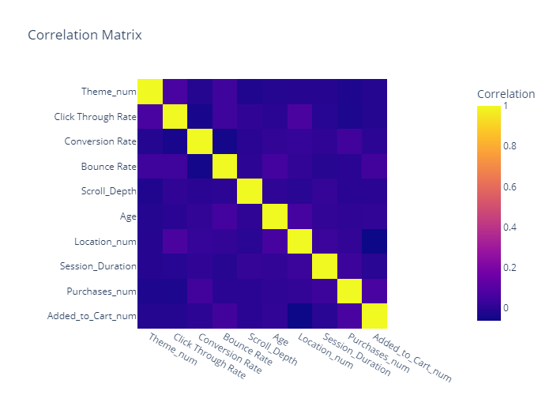
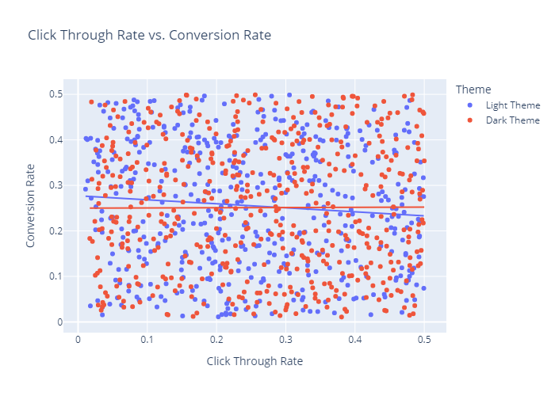
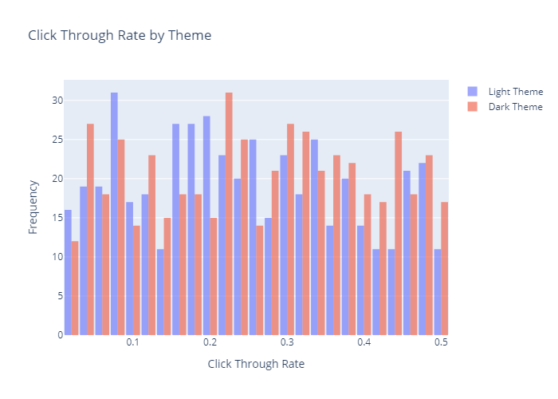
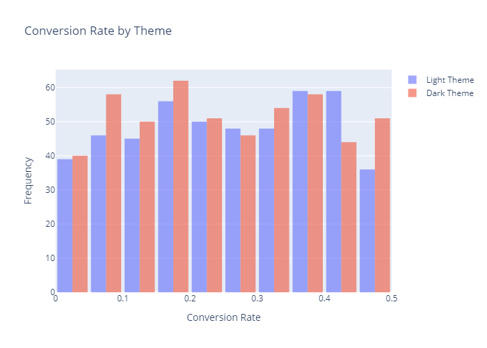
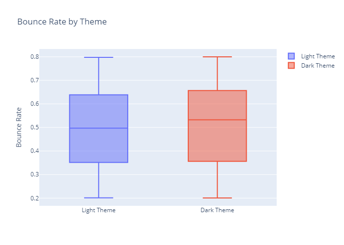
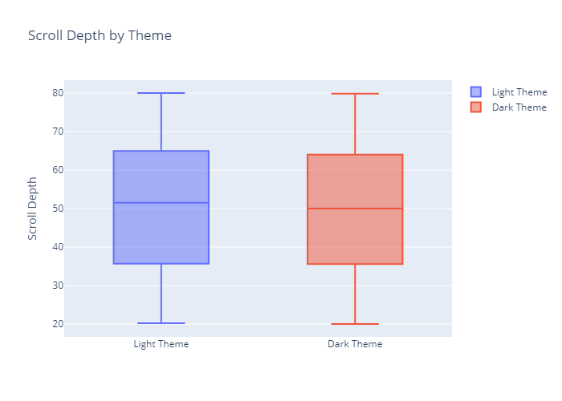
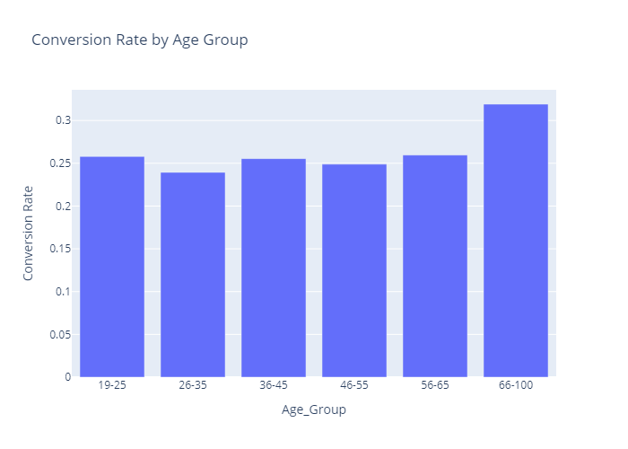

# A/B Testing Light Theme vs Dark Theme

## Overview

This project analyzes website A/B test data to compare user engagement between Light and Dark themes. The primary goal is to assess how different themes impact key metrics like conversion rate, session duration, and bounce rate. The analysis includes correlation analysis, outlier detection, and hypothesis testing, supported by visualizations to provide insights into user behavior and theme effectiveness.

## Exploratory Data Analysis (EDA) performed:

### Correlation Matrix:
- To examine the relationships between various numerical features, such as Session Duration, Conversion Rate, and Bounce Rate.

### Click Through Rate vs Conversion Rate:
- To analyze the relationship between Click Through Rate (CTR) and Conversion Rate across Light and Dark themes.

### Click Through Rate Histogram:
- To visualize the distribution of Click Through Rates for both Light and Dark themes and compare of engagement levels between the two themes.

### Conversion Rate Histogram:
- To compare the Conversion Rates between users exposed to Light and Dark themes and see how different themes affect user conversions.

### Bounce Rate:
- To compare the Bounce Rate of users between Light and Dark themes, giving an idea of how many users leave the site after viewing one page.

### Scroll Depth Rate:
- To visualize the Scroll Depth for users on both Light and Dark themes, revealing how far users are scrolling through the website, which can indicate engagement with the content.

### Segmented Analysis:
- To illustrate how the Conversion Rate varies across different age groups, providing insights into the theme's effectiveness based on the user's age.

## Conclusion

This project builds on the foundational work provided in The Clever Programmer's A/B testing on Light Theme vs Dark Theme using Python by expanding the analysis to provide deeper insights into various other aspects of the user behavior. The analysis indicates that the theme has a measurable impact on user behavior. Users interacting with the Dark Theme tend to have higher conversion rates and session durations, while the Light Theme shows slightly higher engagement in terms of Click Through Rate. Additional hypothesis testing, such as A/B testing for purchases and session duration, supports these findings.

## References
